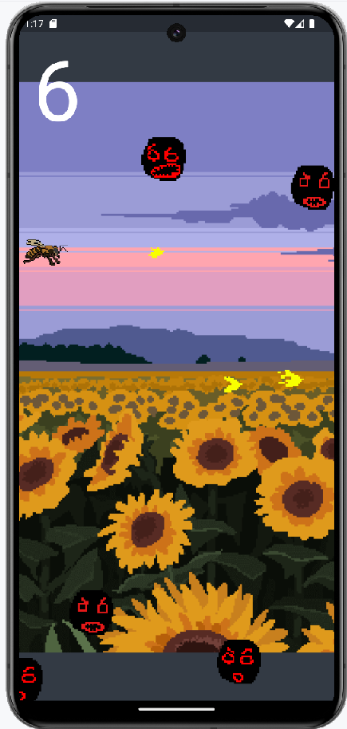

# Primeiro jogo construído com Flame Game

O jogo da Abelinha é um projeto com o objetivo de aprender as principais funcionalidades ofertadas pelo Flame.

O Jogo consiste em acertar os monstros com o polen disparado pela Abelha e conseguir pontos. É um jogo Endless, ou seja não há fim!

Está bem simples e ganhará atualizações, como animações e estilizações. Segue uma imagem do jogo

